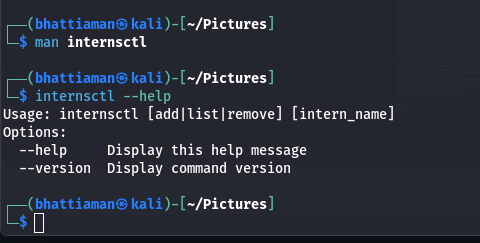
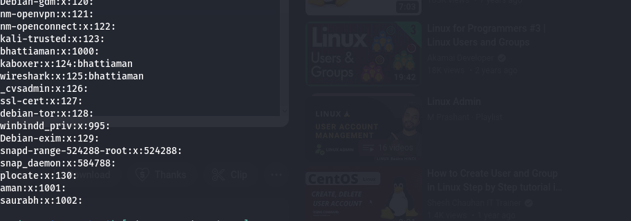
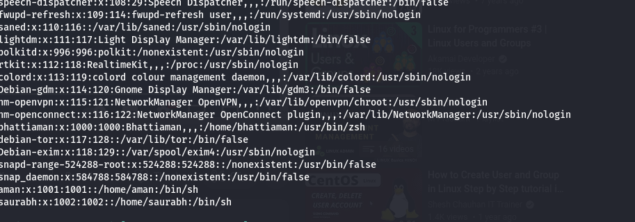

# taskx
# Repository Name

## Section A

### Steps

1. Open terminal and create a file named `internsctl` using `nano internsctl`.
2. Modify the content of the file as per your data.

    ```bash
    cat << 'EOF' > internsctl
    #!/bin/bash

    # Functions and script content...

    EOF
    ```

3. Grant executable permissions to the `internsctl` file using `chmod +x internsctl`.
4. Move the `internsctl` file to `/usr/local/bin/` using `sudo mv internsctl /usr/local/bin/`.
5. Update the manual pages using `sudo mandb`.
6. Task - 1: View the manual of `internsctl` using `man internsctl`.
7. Task - 2: Get help using `internsctl --help`.
8. Task - 3: Check the version using `internsctl --version`.

### man internsctl




## Section B

### Code of part 1

```python
import subprocess

# Function definitions...

if __name__ == "__main__":
    command = input("Enter command: ")  # This can be "internsctl cpu getinfo" or "internsctl memory getinfo"
    output = internsctl(command)
    print(output)
```

I want to get cpu information of my server through the following command:
$ internsctl cpu getinfo
Expected Output -
I want similar output as we get from lscpu command
---
I want to get memory information of my server through the following command:
$ internsctl memory getinfo


# Code for part 2







simple commands play with the root and the user name
I want to create a new user on my server through the following command:
$ internsctl user create <username>
Note - above command should create user who can login to linux system and access his home
directory

I want to list all the regular users present on my server through the following command:
$ internsctl user list

If want to list all the users with sudo permissions on my server through the following command:
$ internsctl user list --sudo-only


